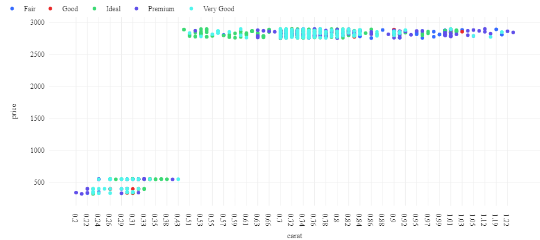

## Pyspark Azure Databricks Experimentation
In this project we will be using a linked pyspark notebook hosted by azure databricks to perform statistical analysis leveraging cloud hosted services. The pdf provided in the repository shows what the notebook looks like while working within an Azure workspace. For demonstration purposes we used a databricks dataset which was approximately 53,000 rows. Using a pyspark notebook in an Azure Databricks workspace allows us to do some very helpful things:

1. Read and write to large data sources.
2. Quickly produce visualizations of this data both in tabular and graphical form 
3. Perform SQL CRUD operations easily. 

Within the pyspark notebook we were quickly able to generate visualizations through a user friendly interface which made plotting quick and intuitive while still allowing for the user to drop into the python plotting languange of choice whenever the UI failed to provide a solution. Some examples of these graphs are below:

Above we see a very quick plot that immediately highlights a key trend in our diamonds data. That there is a distinct clustering of two separate populations. This is likely due to Cubic Zirconia diamonds and we can leverage either SQL queries or simple dataframe operations to subdivide and revisualize our data to just include natural diamonds:
.png>)

You can also see a very simple function which allows us to query a temporary view of the dataframe as a database should we need to perform any CRUD operations. To make these more permanent, we can easily store this dataframe in a database or connect directly to a database. Overall there are some very usefull tools provided by the azure workspaces. Additionally, the workspace is directly linked to this Github repository so all branch changes can be pulled and pushed as required to ensure effective collaboration. 